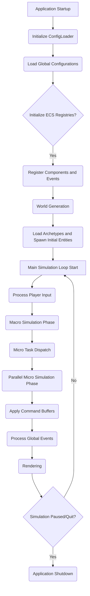

# Simulation Loop Architecture

## 1. High-Level Flow

## 2. Detailed Phases

### 2.1 Application Startup & Initialization
*   **`main()` function**: Entry point of the application.
*   **Initialize Logger**: Setup logging facilities for debug, info, warning, error messages.
*   **Initialize `ConfigLoader`**: Create an instance of `neon_oubliette::config::ConfigLoader`, providing the base path to configuration files.
*   **Load Global Configurations**: Use `ConfigLoader` to load `game_rules.json`, `resource_definitions.json`, and other global parameters into a `RuntimeConfigComponent` (a context component in the macro registry).
*   **Initialize ECS**: 
    *   Create `entt::registry` instances for the macro world (`macro_registry`) and a map of `entt::registry` for micro worlds (e.g., `std::map<entt::entity, entt::registry> micro_registries`).
    *   Initialize `entt::dispatcher` instances for `MacroEventBus` and `MicroEventBus` and add them to the respective registry contexts.
*   **Register Components and Events**: Call `neon_oubliette::ecs::register_all_components(macro_registry)` and `neon_oubliette::ecs::register_all_events(macro_event_bus)`, and similarly for micro registries/buses. This makes EnTT aware of all our types.

### 2.2 World Generation
*   **Load World Generation Parameters**: Use `ConfigLoader::loadWorldGeneratorParams()` to retrieve the `WorldGeneratorParams`.
*   **`WorldGeneratorSystem`**: A system responsible for:
    *   Generating terrain, placing `RoadComponent`s, `ResourceNodeComponent`s, and `BuildingComponent`s based on `WorldGeneratorParams`.
    *   For each `BuildingComponent` created in the `macro_registry`:
        *   Create a new `entt::registry` for its micro world.
        *   Initialize a `MicroEventBus` for it and add to its context.
        *   Spawn initial micro-entities (e.g., `FloorComponent`, `RoomComponent`, `UtilityAllocationComponent`) within the building's micro registry.
        *   Add a `CommandBufferComponent` to the building entity in the macro registry, pointing to its micro registry.

### 2.3 Entity Spawning & Data Population
*   **Load Archetypes**: Use `ConfigLoader` to load `archetypes/*.json` which define templates for common entities (e.g., Citizen, Truck, initial Faction entities).
*   **Initial Entity Spawning**: Based on game rules and world generation, spawn initial populations of NPCs (`CitizenComponent`), vehicles (`VehicleComponent`), and `FactionComponent`s into the macro registry.
    *   For NPCs, assign `HousingPreferenceComponent`, `SkillComponent`, etc.
*   **Link Macro to Micro**: Establish the `MacroCitizenId` link for `ResidentComponent`s when NPCs are assigned housing.

### 2.4 Main Simulation Loop
*   **Loop Condition**: Continues until player quits or a game-over condition is met.
*   **Timing**: Manages fixed or variable time steps (`delta_time`).

#### 2.4.1 Process Player Input
*   Handle user commands (e.g., inspect entity, issue orders, navigate map).
*   Translate input into `CommandComponent`s or direct manipulation of simulation state (for debug/admin).

#### 2.4.2 Macro Simulation Phase
*   **Systems Execution**: Execute all macro-level systems sequentially on the main thread.
    *   `TrafficFlowSystem`: Updates vehicle positions, handles congestion.
    *   `TaxationSystem`: Calculates and collects taxes.
    *   `LaborMarketSystem`: Manages job openings and NPC employment.
    *   `DecaySystem`: Applies degradation to infrastructure.
    *   `PoliticalSystem`: Updates public opinion, faction relationships.
    *   `MacroMarketSystem`: Processes city-wide economic trends.
    *   `AllocationSystem`: Assigns housing, jobs.
*   **Macro-to-Micro Event Generation**: Macro systems can push `RawMaterialDeliveryEvent`s or `TransportationEvent`s into a building's `CommandBufferComponent`.

#### 2.4.3 Micro Task Dispatch
*   **Scheduler**: Iterates through all `BuildingComponent`s in the `macro_registry`.
*   For each building with an active micro registry, a task is created (e.g., using a thread pool or `std::async`). This task encapsulates the execution of micro systems for that specific building.

#### 2.4.4 Parallel Micro Simulation Phase
*   **Micro Systems Execution**: Each dispatched task runs the micro-level systems for its assigned building concurrently.
    *   `ShopInteractionSystem`: Processes NPC purchases.
    *   `WorkstationSystem`: Simulates work, resource consumption/production.
    *   `ElevatorSystem`: Moves elevators, processes requests.
    *   `SanitationSystem`: Manages waste, water quality.
    *   `MicroUtilitySystem`: Distributes power/water within the building.
    *   `NPCBehaviorSystem`: Updates NPC behavior trees, goals, and interactions.
*   **Micro-to-Macro Event Generation**: Micro systems can publish events (e.g., `CommerceEvent`, `DiseaseEvent`) to the `MicroEventBus` of their respective building. These are then aggregated and potentially forwarded to the `MacroEventBus`.

#### 2.4.5 Apply Command Buffers
*   **Deterministic State Update**: After all parallel micro-simulation tasks complete, the main thread sequentially processes all `CommandBufferComponent`s associated with buildings.
*   Each command in the buffer is executed, applying state changes to the respective micro registry in a controlled, deterministic order.

#### 2.4.6 Process Global Events
*   **MacroEventBus Dispatch**: All events accumulated on the `MacroEventBus` (from macro systems or aggregated from micro systems) are now dispatched to their listeners.
*   Listeners (other systems) react to these events, potentially triggering further state changes or command buffer entries.
*   `MicroEventBus` (per-building) events are also processed here, potentially forwarding relevant ones to the `MacroEventBus`.

#### 2.4.7 Rendering
*   **`RenderSystem`**: Collects necessary `PositionComponent`, `AppearanceComponent`, and other visual data from both macro and micro registries.
*   Uses the `Notcurses` library to render the current state to the terminal.
*   Handles viewports, camera movement, and overlay UIs.

### 2.5 Application Shutdown
*   Release all resources (ECS registries, Notcurses context, logger).
*   Save game state (if implemented).
