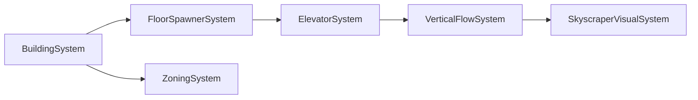

# Verticality Systems Design

## 1. Purpose
The **verticality subsystem** is responsible for modelling multi‑story buildings (skyscrapers, towers, apartment blocks). It provides a clear boundary between *macro* (building level) and *micro* (floor level) worlds while enabling deterministic resource flow, elevator logistics, and visual rendering.

## 2. High‑Level Architecture
```
[Macro Registry]  ──►  BuildingComponent ──►  Micro Registry (FloorRegistry)
          │                                     │
          ├─► BuildingSystem (height, zoning)    ├─► FloorSpawnerSystem
          │                                     │
          └─► VerticalFlowSystem (power, water) │
          │                                     │
          └─► ElevatorSystem (queue, movement) │
```

All systems are *phase‑aware* and register the phase they belong to in the scheduler.

## 3. Component Contracts
| Component | Stored in | Purpose | Example Fields |
|-----------|-----------|---------|----------------|
| `BuildingComponent` | Macro registry | Holds building metadata and a reference to its floor registry | `height`, `elevator`, `zoning`, `floor_registry` |
| `FloorComponent` | Micro registry | Marks a floor and stores per‑floor consumption | `level`, `power_requirement` |
| `ElevatorComponent` | Macro registry | State of the building elevator | `current_floor`, `destination_queue`, `moving` |
| `Zoning` | Macro registry | Enum tag for zoning rules | `Type::Residential`, `Type::Commercial`, … |

## 4. System Responsibilities
| System | Phase | Responsibility | Dependencies |
|--------|-------|----------------|--------------|
| `BuildingSystem` | `Macro` | Spawns/destructs buildings, calculates global resource consumption. | None |
| `FloorSpawnerSystem` | `Micro` | Creates floor entities in the building’s floor registry when the building height changes. | `BuildingComponent` (height) |
| `ElevatorSystem` | `Micro` | Processes elevator queue, moves occupants, emits `ElevatorEvent`. | `ElevatorComponent`, `FloorComponent` |
| `VerticalFlowSystem` | `Macro` | Aggregates per‑floor demands, pulls from global utilities, pushes to each floor. | `FloorComponent` (via floor registry) |
| `SkyscraperVisualSystem` | `Render` | Renders stacked glyphs per floor, applies shading based on height. | `BuildingComponent`, `FloorComponent` |
| `ZoningSystem` | `Macro` | Enforces zoning limits per building. | `BuildingComponent` |

### Dependency Graph


## 5. Deterministic Resource Flow
1. **Collect Consumption**: `VerticalFlowSystem` iterates over every `BuildingComponent`. For each building it queries its `floor_registry` for all `FloorComponent`s and sums their `power_requirement` and `water_requirement`.
2. **Pull from Global Utility**: The building’s `power_consumption` and `water_consumption` are deducted from the global `WorldStats` resource pools.
3. **Distribute to Floors**: The system updates a `FloorResource` component in the micro registry with the allocated amount.

All operations happen in a single, deterministic order: iterate buildings in ascending entity ID, then floors in ascending level. No RNG is involved in resource allocation.

## 6. Elevator Mechanics
- Each elevator request is a **command** added to `ElevatorComponent::destination_queue`.
- The system runs in the `Micro` phase, pulling the first request, moving `current_floor` towards it one level per tick.
- When the elevator reaches the destination, an `ElevatorEvent` is emitted on the building’s event bus, notifying occupants to move.
- Because elevators are stateful and may race between buildings, we guarantee determinism by serializing elevator updates per building in the same order as building IDs.

## 7. Concurrency Model
- **Macro systems** run on the main thread.
- **Micro systems** are dispatched to a thread pool, one task per building. Each task operates on its own floor registry and writes to its building’s command buffer.
- After all micro tasks finish, the `CommandBufferApply` phase merges buffers back into the respective registries.

## 8. Extensibility Hooks
- **Custom Floor Types**: A mod can register a `FloorType` component and a system that reacts to it (e.g., `ZeroGravityFloorSystem`).
- **Elevator AI**: Via `IPlugin` a mod can provide alternative elevator logic (AI‑controlled, scheduled stops).
- **Dynamic Zoning**: `ZoningSystem` can be extended by plugins that add new zoning rules or penalties.

---

**Next**: Draft the *procedural generation* details for city layout and building placement, focusing on seed derivation and deterministic placement.
